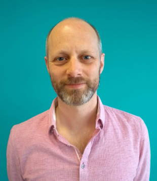

Title: About Me
---
{align="right"} I am a lead developer and technical architect based in Melbourne, Australia, working for [Virgin Pulse](https://virginpulse.com) (formerly "Get The World Moving").

Over the past 12 years I have grown my company's major product offering from a small website with 30,000 Australian users into a solution that serves half a million users worldwide. It is now a distributed, highly available, cloud-hosted service provided via multiple websites and mobile apps.

- I know how to operate motivated, productive and successful development teams, from my personal experience of implementing agile practices and continuous delivery.
- I design resilient, cloud-based solution architectures, with specific deep knowledge of the Microsoft Azure platform.
- My programming skills are primarily ASP.NET using C#, regularly extending into HTML, JavaScript, and SQL.

I have a particular passion for coding that goes the extra mile - be that fantastic usability, ultra fault tolerance, efficient high scaling, or whatever the next challenge I face calls for.

I attend various tech meet-ups in Melbourne and I'm a long standing member of my local school e-Learning sub-committee, helping them navigate the tricky waters of modern technology.

[My LinkedIn Profile](http://www.linkedin.com/in/philgeorge)

